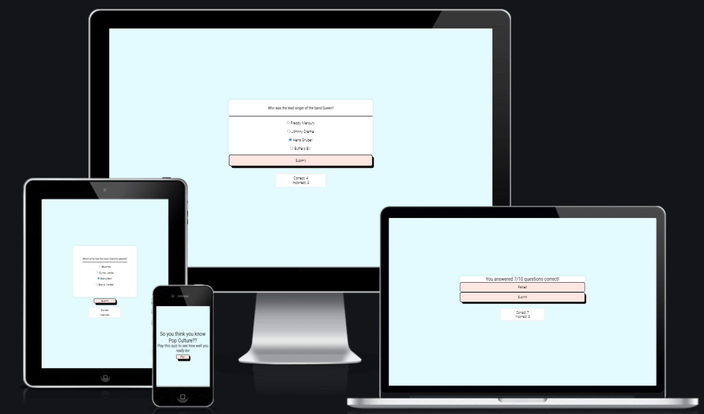

# The Very Varied Quiz

The Very Varied Quiz is an online quiz designed to test your knowledge of Pop Culture! It covers a variety of subjects and mediums including Television, Film and Music. For each question the user is given four answer choices to select from.

A link to the deployed site can be found [here](https://christianlund2.github.io/very-varied-quiz/).

## User Experience

### First Time Users
* As a first time user, I want the intention of the website to be immediately clear and the structure and navigation to be intuitive. 
* As a first time user, I want to know know if I selected the correct answer after making my choice.
* As a first time user, I want my final score to be displayed and have the option to play again.

### Returning Users
* As a returning user, I want to improve my previous high score.

## Design

#### Color Palette
* I wanted to have light, fun pastel colors for my quiz. I decided on a light blue for the main background, a light red/pink for the button and a clean white background for the quiz area to stand out against. 

* Main Background: #e3fbfe
* Button: #fee6e3
* Button Pseudo Effect: #ffdeda

#### Font
* I chose Roboto Condensed because I feel like it is clean and easily readable, has good structure but still gives text some character with it's spacing and curves. 

## Features
* Home Page - The first page the user encounters when the website loads. The introductory heading is easily understood and coaxes the user to play the quiz. The play button initiates the quiz. 

* Game Page - After clicking on the 'Play!' button, the user is taken to the quiz page where the game is played. The text is easy to read and the button has a pseudo effect when hovered over and also when clicked. The score area increments after each user submission. 

* Results Page - After completing the quiz, the user is informed how many questions they answered correctly. They can reload the quiz to play again, or submit their score to the user leaderboard (future feature, see below).

### Features Left to Implement
* A future feature I would like to add is a 'User Leaderboard' where the highest scores are displayed. This would change by quiz, by month or by all-time. 

## Testing
* This project was primarily built in Google Chrome but also in Firefox. It was tested in Microsoft Edge, Firefox and Safari browsers and on mobile phones, laptops and desktop monitors. 
* The 'Play', 'Submit', and 'Reload' buttons all work as intended, moving to the next page or question.
* Also, when running Lighthouse, the SEO comes back limited due to links not being crawlable. But the links are from the font-awesome script and in JavaScript, which is outside of the current scope of this project.
* Accessibility needed to be improved on the 'Submit' button on the quiz. This was solved by increasing the font-weight from 'bold' to 800.

* Lighthouse Desktop

* Lighthouse Mobile

### HTML Errors returned during validator testing: 
* Erros go here

### CSS Errors returned during validator testing: 
* More errors here

### Validator Testing
1 HTML
* No errors were returned when passing through the official [W3C validator](https://validator.w3.org/nu/?doc=https%3A%2F%2Fchristianlund2.github.io%2Ffantasy-fanatics%2F).

2 CSS
* No errors were returned when passing through the official [(Jigsaw) validator](https://jigsaw.w3.org/css-validator/validator?uri=https%3A%2F%2Fchristianlund2.github.io%2Ffantasy-fanatics%2F&profile=css3svg&usermedium=all&warning=1&vextwarning=&lang=en).

3 JS 
* Text

### Unfixed Bugs
* No unfixed bugs remain.

## Deployment
1 This site was deployed to GitHub pages. 
* In the "fantasy-fanatics" repository, click on the "Settings" tab.
* Under "Code and Automation", select the "Pages" section.
* Under Source, change from "Branch: None" to "Branch: Main" and click "Save".
* After a few minutes, a banner appears confirming the site is published with a live link. 

### How to make a clone

## Credits
### Content
1 Sources 

2 More sources
* here
* and here

3 Probably a stackoverflow link

4 wow!

### Media
1 Favicon url