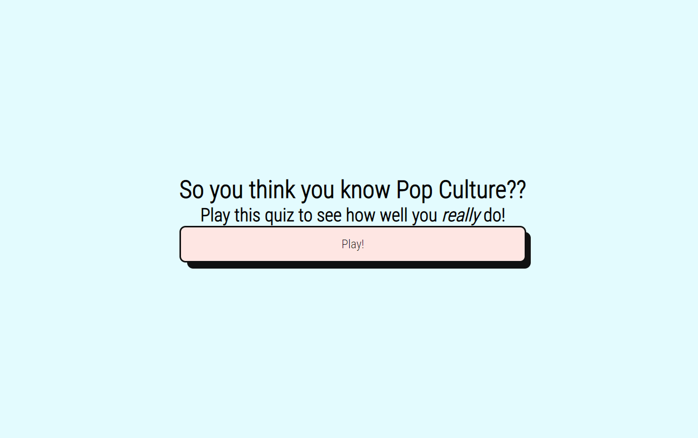
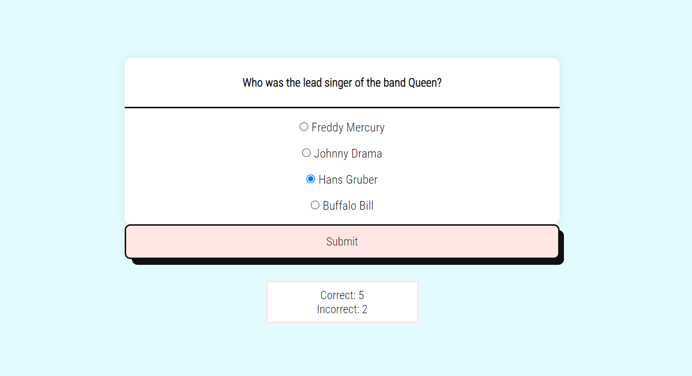
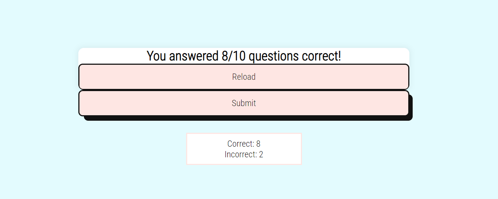
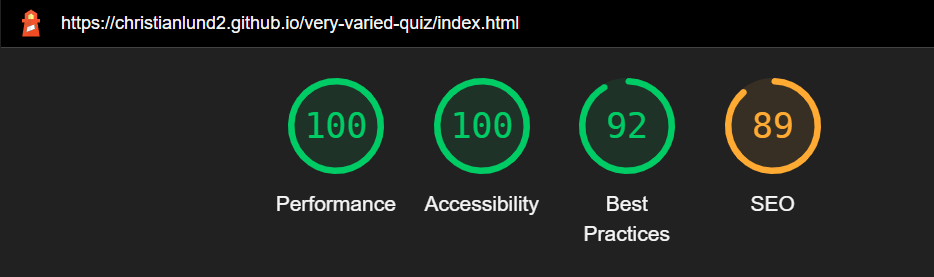
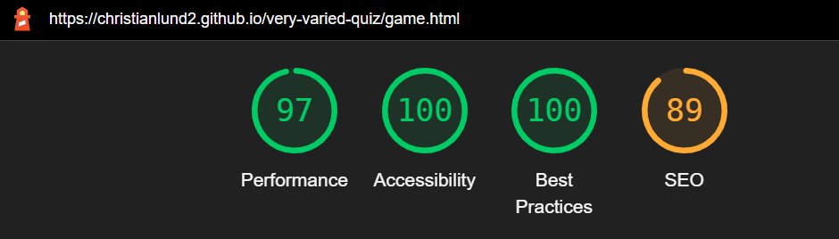
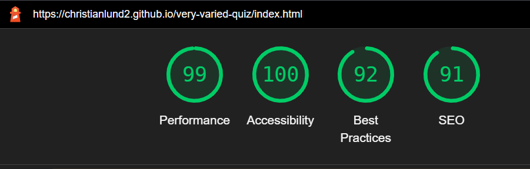
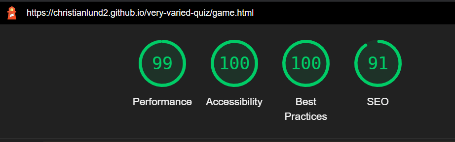

# The Very Varied Quiz

The Very Varied Quiz is an online quiz designed to test your knowledge of Pop Culture! It covers a variety of subjects and mediums including Television, Film and Music. For each question the user is given four answer choices to select from.

A link to the deployed site can be found [here](https://christianlund2.github.io/very-varied-quiz/).

## User Experience

### First Time Users
* As a first time user, I want the intention of the website to be immediately clear and the structure and navigation to be intuitive. 
* As a first time user, I want to know know if I selected the correct answer after making my choice.
* As a first time user, I want my final score to be displayed and have the option to play again.

### Returning Users
* As a returning user, I want to improve my previous high score and see what new questions have been added to the quiz.

## Design

#### Color Palette
* I wanted to have light, fun pastel colors for my quiz. I decided on a light blue for the main background, a light red/pink for the button and a clean white background for the quiz area to stand out against. 

* Main Background: #e3fbfe
* Button: #fee6e3
* Button Pseudo Effect: #ffdeda

#### Font
* I chose Roboto Condensed because I feel like it is clean and easily readable, has good structure but still gives text some character with it's spacing and curves. 

## Features
* Home Page - The first page the user encounters when the website loads. The introductory heading is easily understood and coaxes the user to play the quiz. The play button initiates the quiz. 

* Game Page - After clicking on the 'Play!' button, the user is taken to the quiz page where the game is played. The text is easy to read and the button has a pseudo effect when hovered over and also when clicked. The score area increments after each user submission. 

* Results Page - After completing the quiz, the user is informed how many questions they answered correctly. They can reload the quiz to play again, or submit their score to the user leaderboard (future feature, see below).

## Features Left to Implement
* A future feature I would like to add is a 'User Leaderboard' where the highest scores are displayed. This could be filtered by quiz, by month or by all-time. 

## Testing
* This project was primarily built in Google Chrome but also in Firefox. It was tested in Microsoft Edge, Firefox and Safari browsers and on mobile phones, laptops and desktop monitors. 
* The 'Play', 'Submit', and 'Reload' buttons all work as intended, moving to the next page or question.
* When running Lighthouse for Desktop, the SEO comes back limited due to links not being crawlable. But the links are from third parties and not from my own code. 
* When running Lighthouse for Mobile, the performance was limited but was remedied by removing the fontawesome script from the index and game html files. 

* Lighthouse Desktop - Index Page

* Lighthouse Desktop - Game Page

* Lighthouse Mobile - Index Page

* Lighthouse Mobile - Game Page

### Validator Testing
HTML
* No errors were returned when passing through the official [W3C validator](https://validator.w3.org/nu/?doc=https%3A%2F%2Fchristianlund2.github.io%2Fvery-varied-quiz%2Fgame.html).

CSS
* No errors were returned when passing through the official [(Jigsaw) validator](https://jigsaw.w3.org/css-validator/validator?uri=https%3A%2F%2Fchristianlund2.github.io%2Fvery-varied-quiz%2Fgame.html&profile=css3svg&usermedium=all&warning=1&vextwarning=&lang=en).

JavaScript 
* When run through JShint I had a lot of missing semi-colons. There were variables that I named or intended to use when wireframing that were not used and later removed. JShint was also giving me warnings when I used const for variables, this was fixed by adding '/*jshint esversion: 6 */' to the top of my js file. 

### Unfixed Bugs
* At random intervals I get a 'Browser is not defined' error, but I sturggle to consistently duplicate it across browsers and devices. 
* My favicon shows on the tab in port 8000 preview on GitPod but not on the deployed site on Github. 

## Deployment
1. This site was deployed to GitHub pages. 
* In the "very-varied-quiz" repository, click on the "Settings" tab.
* Under "Code and Automation", select the "Pages" section.
* Under Source, change from "Branch: None" to "Branch: Main" and click "Save".
* After a few minutes, a banner appears confirming the site is published with a live link. 

### How to make a clone
* While in your repository, click the code button.
* You will have three options, Clone, Download or Open with Github Desktop. 
* Clone the repository using HTTPS by clicking on the copy button. Then copy the given URL.
* You can then either launch the Gitpod workspace or choose your own directory.
* Open Git Bash.
* Type git clone and then paste the URL of the cloned repository.
* Press Enter, to create your local clone to your chosen directory.

## Credits

1. Love Maths Project - An obvious help. Although I didn't make a game, the foundations were very helpful. 

2. Youtube: Web Dev Simplified - "Build a Quiz App with Javascript" - This was a great resource for this project. I went through this video multiple times. Great for starting with the basics.

3. Youtube: Coding with Nick - "Create a Quiz App using HTML CSS & JavaScript" - This was another solid video. He explains a bit more about why things are set in a particular way. 

4. Lots of StackOverflow threads. Too many to count.

5. Reddit, specifically r/learnjavascript and r/learnprogramming. I didn't really use any code there but more just for different ideas on problem solving and thinking outside the box. 

6. Credit to my mentor for providing guidance on best practice tips.

### Media
1. Favicon: https://github.com/twitter/twemoji/blob/master/assets/svg/1f916.svg
2. Button sourced from: https://getcssscan.com/css-buttons-examples - number 56.